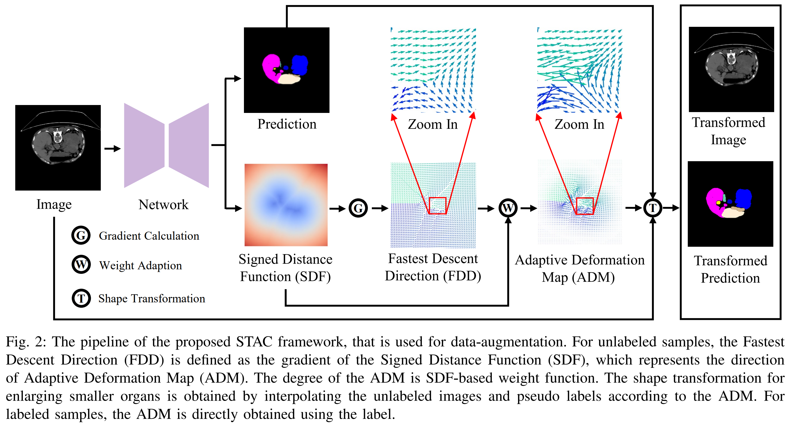

<p align="center">
  <h1 align="center"> Shape Transformation Driven by Active Contour for Class-Imbalanced Semi-Supervised Medical Image Segmentation</h1>
  <p align="center">
 Yuliang Gu, Yepeng Liu, Zhichao Sun, Jinchi Zhu, Yongchao Xu, and Laurent Najman
  </p>
</p>


[](LICENSE)

## Overview

we propose a novel **S**hape **T**ransformation driven by **A**ctive **C**ontour (STAC), that enlarges smaller organs to alleviate imbalanced class distribution across different organs. 


Inspired by curve evolution theory in  active contour methods, STAC employs a signed distance function (SDF) as the level set function, 
to implicitly represent the shape of organs, and deforms voxels in the direction of the steepest descent of SDF (\ie, the normal vector). To ensure that the voxels far from expansion organs  remain unchanged, we design an SDF-based weight function to control the degree of deformation for each voxel.




## Table of Contents

- [Installation](#installation)
- [Dataset](#dataset)
- [Usage](#usage)
- [Results](#results)
- [License](#license)
- [Citation](#Citation)
- [Acknowledgements](#Acknowledgements)
## Installation

Please follow the guide to install and set up the project.

```bash
# Clone the repository
git clone https://github.com/GuGuLL123/STAC.git

# Create conda environment
conda env create -f environment.yml
conda activate stac
```

## Dataset
Please refer to <a href="https://github.com/xmed-lab/DHC/tree/main/">DHC</a> for downloading and preprocessing data.

#### 2.1 AMOS
The dataset can be downloaded from https://amos22.grand-challenge.org/Dataset/

Run `./code/data/preprocess_amos.py` to pre-process.

#### 2.2 Synapse
The MR imaging scans are available at https://www.synapse.org/#!Synapse:syn3193805/wiki/.
Please sign up and download the dataset. 

Run `./code/data/preprocess.py` 


## Usage
Run the following commands for training, testing and evaluating. 

```shell
bash train3times_seeds_2p.sh -c 0 -t amos -m dhc_stac -e with_stac -l 3e-2 -w 0.1 -s 1
```
`2p` denotes training with 2% labeled data, you can change this to `2p`, `5p`, ... for 2%, 5%, ... labeled data.

Parameters:

`-c`: use which gpu to train

`-t`: task, can be `synapse` or `amos`

`-m`: method, `dhc_stac` is our proposed method, `dhc` means the baseline method.

`-e`: name of current experiment

`-l`: learning rate

`-w`: weight of unsupervised loss

`-s`: whether to use the STAC method.

### 4. Results

#### 4.1 AMOS
15 classes: spleen, right kidney, left kidney, gallbladder, esophagus, liver, stomach, aorta, inferior vena cava, pancreas, right adrenal gland, left adrenal gland, duodenum, bladder, prostate/uterus
_4.1.1 Trained with 2% labeled data_


_4.1.2 Trained with 5% labeled data_


#### 4.2 Synapse
13 classes: Sp: spleen, RK: right kidney, LK: left kidney, Ga: gallbladder, Es: esophagus, Li: liver, St: stomach, Ao: aorta, IVC: inferior vena cava, PSV: portal & splenic veins, Pa: pancreas, RAG: right adrenal gland, LAG: left adrenal gland.

_4.2.1 Trained with 10% labeled data_


_4.2.2 Trained with 20% labeled data_


## License
This project is licensed under the MIT License

## Citation
```bibtex
@misc{sun2024positionguided,
      title={Shape Transformation Driven by Active Contour for Class-Imbalanced Semi-Supervised Medical Image Segmentation}, 
      author={Yuliang Gu, Yepeng Liu, Zhichao Sun, Jinchi Zhu, Yongchao Xu, and Laurent Najman},
      year={2024},
      eprint={},
      archivePrefix={arXiv}
}
```

## Acknowledgements

We borrow some codes from 

 - https://github.com/xmed-lab/DHC/tree/main